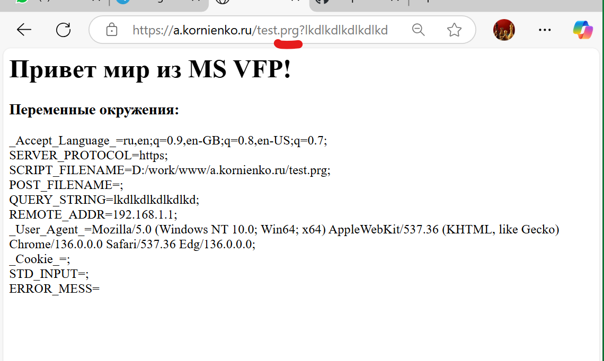

# http.net and https.net
Multithreaded http.net and https.net servers with Visual Foxpro on COM and with Python on fast CGI by default, with protection from DoS-attacks.  

Многопоточные http.net и https.net серверы с Visual Foxpro на COM и с Python на быстром CGI по умолчанию, с защитой от DoS-атак.
### General information
The root folder for domains (www by default) should contain folders corresponding to the domain name and subdomain of the requested resource. If the request looks like http://a.kornienko.ru or https://a.kornienko.ru, then the root folder for domains should contain a folder named a.kornienko.ru, for example: D:/work/www/a.kornienko.ru. If you need the folder to open at a different address, you should create a corresponding symbolic link to the same folder so that one folder is available at two different paths. To do this, use the Windows mklink command with the /d key.  

The number of threads should not be set to the maximum possible. The default is 100. Watch the log, the last numeric field in each entry shows the number of the running thread. Over time, you will understand how many simultaneous threads you have in use. This value is probably significantly less than 100.  

Http and https servers support only fast CGI, using a simple script using the quick start technology. For example, for the Python language, this is the initcgi.py script, given in the repository in the NET4/www/ folder. The script interpreter runs the initcgi script not at the moment of receiving a request from the client, but after sending the next response. Such an initial script can be implemented in most modern interpreted languages. This does not apply to prg scripts, for which the initCGI role is performed by the VisualFoxPro.Application COM server.  

By default, http and https servers will process scripts in Visual Foxpro and Python. But in the server parameters, you can replace the script extension and handler with any other that you prefer for one reason or another — the popular php or "dotnet fsi", which executes scripts with the fsx extension, written in F#.  

Prg scripts are processed using COM technology and VFP 9/10(Advanced) DBMS, not CGI. COM objects are created as requests from clients are executed. By default, visual error output in VFP 9/10(Advanced) DBMS is disabled. In case of an error in prg, a description of this error is returned to the script in the ERROR_MESS variable. Below is an example of a prg file and the result of its work. And also the result of working with a similar prg file, but with an error (the last line break ";" is missing).
```PowerShell
PS D:\> D:\work\httpd\http.net.exe /?
Multithreaded http.net server version 3.7.7, (C) a.kornienko.ru December 2025.

USAGE:
    http.net [Parameter1 Value1] [Parameter2 Value2] ...
    http.net /regserver               Starting the server when the computer is turned on.
    http.net /unregserver             Deleting the server startup task.

    If necessary, Parameter and Value pairs are specified. If the value is text and contains
    spaces, then it must be enclosed in quotation marks. You can also specify the string of
    parameters in the xml file in the <Arguments></Arguments> section.

Parameters:                                                                  Default values:
     -d      Folder containing the domains.                                      ../www/
     -i      Main document is in the folder. The main document in the            index.html
             folder specified by the -d parameter is used to display the page
             with the 404 code - file was not found. To compress traffic,
             files compressed using gzip method of the name.expansion.gz type
             are supported, for example - index.html.gz or library.js.gz etc.
     -p      Port that the server is listening on.                               8080
     -b      Size of read/write buffers.                                         131072
     -s      Number of requests being processed at the same time. Maximum        100
             value is 1000.
     -s1     The number of allowed wait threads per IP address.                  3
     -q      Number requests stored in the queue.                                100
     -w      Allowed time to reserve an open channel for request that did not    10
             started. From 1 to 20 seconds.
     -n      Maximum number of dynamically running interpreters or MS VFP        30
             instances. Processes are launched as needed depending on the
             number of concurrent requests. Maximum value is 1000.
     -log    Size of the query log in rows. The log consists of two              10000
             interleaved versions http.net.x.log and http.net.y.log. If the
             size is set to less than 80, then the log is not kept.
     -post   Maximum size of the accepted request to transfer to the script      33554432
             file. If it is exceeded, the request is placed in a file,
             the name of which is passed to the script in the environment
             variable POST_FILENAME. Other generated environment variables -
             SERVER_PROTOCOL, SCRIPT_FILENAME, QUERY_STRING, HTTP_HEADERS,
             REMOTE_ADDR. If the form-... directive is missing from the
             request data, then incoming data stream will be placed entirely
             in a file. This feature can be used to transfer files to the
             server. In this case, the file name will be in the environment
             variable POST_FILENAME.
     -proc   Script handler used. If necessary, you must also include            python.exe
             the full path to the executable file.
     -args   Additional parameters of the handler startup command line.
     -ext    Extension of the script files.                                      pyc
```
### Общие сведения
Корневая папка для доменов (по умолчанию www) должна содержать папки, соответствующие доменному имени и поддомену запрашиваемого ресурса. Если запрос выглядит как http://a.kornienko.ru или https://a.kornienko.ru, то в корневой папке для доменов должна быть папка с именем a.kornienko.ru, например: D:/work/www/a.kornienko.ru. Если вам нужно, чтобы эта же папка открывалась по другому адресу, то вы должны на эту папку создать соответствующую символическую ссылку, чтобы одна папка была доступна по двум разным путям. Для этого воспользуйтесь командой Windows mklink с ключем /d.  

Число потоков не следут задавать максимально возможным. По умолчанию — 100. Наблюдайте за журналом, в последнем числовом поле в каждой записи отображен номер работающего потока. Со временем вы поймете какое число одновременных потоков у вас используется. Вероятно это значение значительно меньше 100.  

Серверы http и https поддерживают только быстрый CGI, используя простой скрипт по технологии быстрый старт. Например, для языка Python это скрипт initcgi.py, приведеный в репозитории в папке NET4/www/. Интерпретатор скриптов запускает initcgi-скрипт не в момент поступления запроса от клиента, а после отправки очередного ответа. Такой начальный скрипт может быть реализовон на большинстве современных интерпретируемых языках. Это не относится к скриптам prg, у которых роль initCGI выполняет COM-сервер VisualFoxPro.Application.  

По умолчанию серверы http и https будут обрабатывать скрипты на Visual Foxpro и Python. Но в параметрах серверов вы можете заменить расширение скрипта и обработчик на любое другое, которому вы по тем или иным причинам отдаете предпочтение — на популярный php или на "dotnet fsi", выполняющий скрипты с расширением fsx, написанные на F#.  

Обработка prg-скриптов происходит с использованием технологии COM и СУБД VFP 9/10(Advanced), а не CGI. COM-объекты создаются по мере выполнения запросов от клиентов. По умолчанию визуальный вывод ошибок в СУБД VFP 9/10(Advanced) отключен. В случае ошибки в prg описание этой ошибки возвращается скрипту в переменной ERROR_MESS. Ниже приведены примеры тестового файла py, файла prg и результат его работы. А также результат работы с аналогичным файлом prg, но с ошибкой (отсутствует разрыв последней строки ";").
### Пример Python скрипта test.py
```Python
# # # # # # # # # # # # # # # # # # # # # # # # # # # # # # # # # #
# Тест. Вывод переменных окружения.                   03.05.2025  #
# # # # # # # # # # # # # # # # # # # # # # # # # # # # # # # # # #
import os, sys

sys.stdout.write("Content-Type: text/html; charset='utf-8'\n\n")

sys.stdout.write("<h1>Привет мир из Python!</h1>\n" + \
   "<h3>Переменные окружения:</h3>\n" + \
   "Accept-Language=" + os.getenv("Accept-Language","") + ";<br>\n" + \
   "SERVER_PROTOCOL=" + os.environ["SERVER_PROTOCOL"] + ";<br>\n" + \
   "SCRIPT_FILENAME=" + os.environ["SCRIPT_FILENAME"] + ";<br>\n" + \
   "POST_FILENAME=" + os.environ["POST_FILENAME"] + ";<br>\n" + \
   "QUERY_STRING=" + os.environ["QUERY_STRING"] + ";<br>\n" + \
   "REMOTE_ADDR=" + os.environ["REMOTE_ADDR"] + ";<br>\n" + \
   "User-Agent=" + os.getenv("User-Agent","") + ";<br>\n" + \
   "Cookie=" + os.getenv("Cookie","") + ";<br>\n" + \
   "STD_INPUT=" + sys.stdin.read() + ".")

# P.S.
# Также могут быть доступны и многие другие переменные окружения.
# Перед использованием таких переменных следует проверять их
# наличие. Названия прочих переменных окружения совпадают с
# названиями заголовков в поступившем запросе.
```
Пример онлайн https://a.kornienko.ru/test.pyc?lkdlkdlkdlkdlkd
### Пример Visual Foxpro скрипта test.prg
```xBase
* * * * * * * * * * * * * * * * * * * * * * * * * * * * * * * * * *
*  Тест. Вывод переменных окружения.           версия 03.05.2025  *
* * * * * * * * * * * * * * * * * * * * * * * * * * * * * * * * * *
  CRLF = chr(13) + chr(10)
  STD_INPUT = Strconv(STD_IO.ReadToEnd(),11)

* P.S. До этого присвоения информация из STD_IO, находящаяся в качестве
* стандартного ввода, должна быть прочитана:
  STD_IO.Write('Content-Type: text/html; charset="windows-1251"' + CRLF + CRLF)
* Параметр charset="windows-1251" означает, что кодировка передаваемого
* текста - "windows-1251".

  STD_IO.Write("<h1>Привет мир из Visual FoxPro!</h1>" + ;
     "<h3>Переменные окружения:</h3>" + ;
     "_Accept_Language_=" + iif(Type('_Accept_Language_')="C", ;
                      _Accept_Language_,"") + ";<br>" + CRLF + ;
     "SERVER_PROTOCOL=" + SERVER_PROTOCOL + ";<br>" + CRLF + ;
     "SCRIPT_FILENAME=" + SCRIPT_FILENAME + ";<br>" + CRLF + ;
     "POST_FILENAME=" + POST_FILENAME + ";<br>" + CRLF +;
     "QUERY_STRING=" + QUERY_STRING + ";<br>" + CRLF + ;
     "REMOTE_ADDR=" + REMOTE_ADDR + ";<br>" + CRLF + ;
     "_User_Agent_=" + iif(Type('_User_Agent_')="C", ;
                 _User_Agent_,"") + ";<br>" + CRLF + ;
     "_Cookie_=" + iif(Type('_Cookie_')="C",  ;
             _Cookie_,"") + ";<br>" + CRLF +  ;
     "STD_INPUT=" + STD_INPUT + ";<br>" + CRLF)

  STD_IO.Write("ERROR_MESS=" + ERROR_MESS)

* P.S.
* Также могут быть доступны и многие другие переменные окружения.
* Перед использованием таких переменных следует проверять их
* наличие. Названия прочих переменных окружения соответстуют
* названиям заголовков в поступившем запросе.
```
Пример онлайн https://a.kornienko.ru/test.prg?lkdlkdlkdlkdlkd  

The visual result of the prg script:


If there is an error in the prg file:

### Входящий поток POST и кодировка
Серверы http.net и https.net принимают и передают скрипту входящий поток как есть и поэтому кодировка потока не изменяется.
#### Классические обработчики
Существуют весьма разнообразные обработчики (интерпритаторы). Среди них могут быть такие, которые не поддерживают многобыйтовые строки в UTF-8 кодировке. Серверы http/https.net передают POST данные как есть, и если требуется перекодировка данных, то это должны выполнять сами скрипты.
#### Обработчик VFP/VFPA
Для prg скриптов в качастве стандартного ввода-вывода для VFP серверы формируют объект STD_IO, который создается в COM-сервере VFP.memlib32/VFP.memlib. Обычно входящий поток поступает в кодировке UTF-8. Поэтому prg скрипт должен конвертировать эти данные, находящиеся в COM-объекте STD_IO, в свою внутреннюю системную кодировку. В VFP/VFPA для этого есть удобная функция Strconv(). Чтобы конвертировать весь входящий поток POST из UTF-8 используется обращение `STD_INPUT=Strconv(STD_IO.ReadToEnd(),11)`. Если у вас в данных POST не ожидаются буквы национальных алфавитов, а только цифры, буквы английского алфавита и стандартные знаки, то конвертировать входящий поток не обязательно.  

В VFP/VFPA со временем происходит утечка памяти. Поэтому очень важно по окончании работы prg делать очистку всех переменных и объектов.  

Для безотказной работы MS VFP был разработан COM-сервер [VFP.memlib32/VFP.memlib](https://github.com/Arkady23/VFP.memlib), который создает потоки ввода-вывода в отдельныой области памяти.
##### Очистка VFP/VFPA после окончания работы prg скрипта
После окончания работы prg скрипта серверы http/https.net выполняют комады:
```xBase
  STD_IO.CloseAll();
  clos data all
  clea even
  clea prog
  clea all
  clos all
```
Однако вместо этих команд вы можете использовать свой вариант очистки, создав файл VFPclear.prg в папке, на которую указывает команда VFP sys(2004). Важно, чтобы вы не забыли добавить в этот файл указанные выше команды, в противном случае VFP/VFPA может работать не стабильно.  

Если вы работаете с большими объемами памяти или предполагается большая нагрузка на VFP или у вас возникнают проблемы с памятью, то вы можете использовать полное закрытие VFP командой Quit. Команду Quit вы можете поставить в конце prg-скрипта или вместо команд очистки в VFPclear.prg. В любом случае по окончанию сессии при отсутствии VFP сервер его перезапустит. Это может немного замедлить работу VFP, но при этом повысится устойчивость СУБД.
#### Передача входящего потока в файл
Серверы http.net и https.net воспринимают поток POST, если он присутствует, в двух вариантах — как стандартный ввод или как принимаемый произвольный файл, в зависимости от заголовка "Content-Disposition". Если в этом заголовке обнаружен параметр "filename", то весь поток POST помещается в указанный параметром filename файл.
### Исходящий поток и кодировка
Исходящий поток формирует сам скрипт. Этот поток как правило предназначен для обозревателя интернет на стороне клиента. И здесь надо учитывать, что не все обозреватели принимают кодировку по умолчанию UTF-8. Например, обозреватель Edge считает кодировкой по умолчанию национальную кодировку Windows, например, Windows-1251. Поэтому не лишним будет указать необходимую кодировку в заголовке Content-Type в параметре charset, например, `Content-Type: text/plain; charset="utf-8"`. Серверы передают исходящий поток как есть.  
#### Классические обработчики
Если вы используете обработчик (интерпретатор), не поддерживаюзий кодировку UTF-8 и вам нужно отправлять символы национальных алфавитов, то как вариант, вам необходимо создать пользовательскую функцию преобразовывающую передаваемую строку в кодировку UTF-8 или любую другую кодировку, не использующую символы национальных алфавитов.
#### Обработчик VFP/VFPA
Для оброботчика VFP/VFPA, чтобы формировать строки, содержащие символы национальных алфавитов, в кодировке UTF-8, существует команда `UTFstring=Strconv(VFPstring,9)`.
### Обсуждение
Задать вопрос или обсудить тему, касающуюся серверов http/https.net или VFP/VFPA, вы можете в разделе проекта `Issues` > `New issue`.  

### История версий
В папках httpd и https всегда можно скачать последние рабочие версии http.net.exe и https.net.exe.  
  
1.0. Январь 2023. Первая версия.  
1.1. Февраль 2023. По рекомендации MS Corp. убраны массивы с динамически изменяющимися размерами в целях уменьшения нагрузки на системный сборщик мусора в ОП. Добавлено кэширование небольших файлов с целью увеличения скорости работы сервера.  
1.2. Апрель 2023. Реализовано сохранение буферов журнала запросов при бездействии сервера в течении 3 с.  
1.3. Май 2023. Исправлена ошибка буферизации при кешировании небольших файлов.  
1.4. Ноябрь 2023. При отсылке результата скрипта теперь не отсылается заголовок длины этого результата и не закрывается блок заголовков в целях соблюдения приемственности известных http-серверов, например такого, как Apache.  
1.5. Январь 2024. Добавлена переменная окружения SCRIPT_FILENAME.  
1.6. Январь 2024. Исправлена ошибка кодировки при скачивании файлов через пользовательские скрипты.  
1.7. Февраль 2024. Устранено исключение, появляющееся при закрытии сервера.  
1.8. Март 2024. Добавлено чтение имени файла из заголовка вида Content-Disposition: attachment; filename="filename.jpg" (Используется при загрузке файлов методом POST).  
1.81. Март 2024. Ужесточена безопасность. Клиент сможет делать запросы к ресурсам только в пределах папки с доменом/поддоменом и только к файлам с разрешенными расширениями. Добавлена возможность использования СУБД MS Foxpro 9/10(Advanced) через COM технологию с расширением скриптов — prg.  
1.82. Март 2024. Убран концевой перевод строки после возвращаемых данных пользовательских скриптов.  
1.83. Март 2024. Добавлено использование кодовой страницы конфигурации СУБД VFP при возвращении результата prg файла.  
1.9. Апрель 2024. Добавлен параметр используемой сервером кодовой страницы -cp для обработки текстовых потоков.  
1.91. Апрель 2024. Добавлено немного больше асинхронности между сессиями.  
1.92. Апрель 2024. Увеличена стабильность существования потоков сессий.  
1.93. Апрель 2024. Заменён класс асинхронного цикла верхнего уровня, порождающего потоки, на класс параллельного выполнения.  
1.94. Апрель 2024. Увеличено число рабочих потоков. Запмсь в журнал переведена в отдельный поток с меньшим приоритетом.   
1.95. Апрель 2024. Число рабочих потоков увеличено до максимума, до значения, заданного параметром -s. При этом контроль правильности задания этого параметра ложится на пользователя путем анализа журнала, где первые две записи фиксируют время запуска сервера и время инициализации задач.  
2.0-2.1. Май-июнь 2024. Оптимизация кода.  
2.11-2.12. Июнь 2024. Обработка случая разрыва связи с клиентом.  
2.13-2.14. Июнь 2024. Теперь переменная окружения SCRIPT_FILENAME содержит полный путь к скрипту.  
2.15. Июнь 2024. Предусмотрен случай закрытия процесса VFP пользовательским prg.  
2.2. Июль 2024. Оптимизация кода. Добавление разрешения для проверки доменов сервера методом http-1 при получении сертификатов, необходимых для работы через протокол https.   
2.21-2.22. July 2024. The default code page is now taken from the Windows code page data. The help text has been translated into English.  
2.23. July 2024. Synchronization bug.  
2.24. July 2024. Put request bug.  
2.3. August 2024. When sending the script result, the "Content-Type: text/html" header is no longer added in order to maintain the continuity of well-known http servers, such as Apache. Just like when using Apache and others, user now has to generate this header himself.  
2.31. August 2024. Fixed a bug when using the -i command line option. Added automatic substitution of the extension, if it is missing. First, a resource without an extension is perceived as a folder, if such a folder is missing, then default script extension for the script is added, if the file is missing, then the server tries to execute the script with the prg extension, if this file is not found, then the html extension is substituted.    
2.32. August 2024. Added recognition of the POST length limit for different versions of MS VFP and VFPA.  
2.33. August 2024. The HTTP_COOKIE environment variable has been removed, and HTTP_HEADERS has been added.  
2.3.4. August 2024. Fixed VFP COM crash error. The version has been moved from the Debug state to Release.  
2.3.5. August 2024. After finishing the prg script, the "clear prog" command is added.  
2.3.6. August 2024. Message is available for the case of using outdated versions of Windows.  
2.3.7. August 2024. Bug of incorrect processing of command line parameters has been fixed.  
2.3.8. August 2024. Fixed an exception that is likely to occur when a connection is broken.  
2.3.9. August 2024. Caching of small files is now done asynchronously.  
2.3.10. August 2024. Asynchrony of extracting files from the cache has been removed, and asynchrony of transferring files over a socket has been reduced due to errors that occur.  
2.3.11. August 2024. Additional command line parameter control is set.  
2.4. September 2024. Added file name decoding command to download files with names in national Windows encodings. If a critical VFP error occurs when trying to execute the prg script, then now the error message is converted to UTF-8 encoding.  
2.4.1. September 2024. Added the ability to replace the standard set of VFP commands to clean up trash after the script is finished before executing the next script written in prg. The availability of the new set of commands is checked in the sys(2004)+'VFPclear.prg' file. If no such prg is found, then the standard set of commands is executed: clean even, clear prog, clear all, close data all and close all.  
2.4.2. September 2024. The request log contains the number of the task in which it is being processed.  
2.5.0. October 2024. The European encoding has been replaced with UTF-8. After switching the log to another file, all entries in this log are deleted for easy readability.  
2.5.1. October 2024. Now the encoding specified in the charset parameter in the Content-Type header is applied, if it is specified correctly. UTF-8 is used by default.  
2.5.2. October 2024. Fixed a flaw for redirecting to index.html.  
2.5.3. October 2024. Fixed the error of adding a small file to the dictionary.  
2.5.4. October 2024. Caching of small files has been removed due to the lack of effect. Default read/write buffer size has been increased.  
2.5.5-2.6.0. October-November 2024. Fixing the task stack overflow error.  
2.6.1. November 2024. Default values have been changed for more stable server functioning. The SERVER_PROTOCOL environment variable has been added.  
2.6.2-2.6.3. November 2024. Added syntactic control of the query method. The value of the response duration in ms has been added to the log, the symbol "-" when the server refuses to process the request, and some other changes in the log.  
2.6.4. November 2024. Minor corrections. Fixed bug blocking the SSL stream in https.net server.  
2.6.5-2.6.6. November 2024. If the file name with the default extension matches the existing directory name, then the request is now considered for an existing file.  
2.6.7. November 2024. Information about the server version has been added to the log.  
2.6.8. November 2024. Fixed a bug for the API variant.  
2.6.9. November 2024. It is set to cancel the request if the client, having established a connection, does not start sending headers within 10 seconds. Such requests could block the server. If execution error occurs, the message is now sent to the http.net.err.log file.  
2.6.10. November 2024. The logs are switched between each other when one of them is filled up to a set number of lines.  
2.7.0. Added an option to start the server with the command line parameters located in the file.  
3.0.0. January 2025. The appearance of the program has been changed from a console application to a form. The icon has been added to the tray. Now one socket buffer is used to read the request, and the same is used to write the response. The _Screen.STD_IO object has been added to VFP, which is used as standard input/output. The Return operator is now used only in API mode to return the HTTP status code. Double buffering is also used. In fact, one buffer is equal to half of the value specified by the parameters. Double buffering improves server performance.  
3.1.0. February 2025. Code optimization, added deletion of the client's session folder after performing a POST to a file.  
3.1.1. February 2025. Increasing the maximum number of threads and default databases used.  
3.2.0. March 2025. Added launch of vfp instance if user quit it.  
3.2.1. March 2025. Since this version, the VFP.memlib COM server is used to implement streams.  
3.2.2. March 2025. Removed left spaces from header values ​​(after colons) placed in the HTTP_HEADERS variable.  
3.2.3. March 2025. Fixed a bug with desynchronization of the prg result output.  
3.2.4. March 2025. Added protection against DoS-​​attacks. Thanks to the hackers for testing my server sometimes :-)  
3.2.5. March 2025. The client connection time limit is set according to the -w command line parameter.  
3.2.6. March 2025. Fixed bugs in versions 3.2.4 and 3.2.5.  
3.2.7. March 2025. The capacity of the simophore has been reduced by 1 to fix a stack zeroing bug during a DoS-attack.  
3.3.0. April 2025. The capacity of the simophore has been reduced by 2 to fix a stack zeroing bug during a DoS-attack.  
3.3.1. April 2025. Changed default values. Handles stack zeroing exception during DoS-attacks.  
3.3.2. April 2025. Added connection reset in case of DoS-attack.  
3.3.3. April 2025. Added additional control over DoS-attack (only for https). The blocked IP is marked in the log as "--".  
3.3.4. April 2025. Reduced the threshold for blocking DoS-attacks.  
3.3.5. April 2025. Replaced default script handler with Python. Switched to fast start initCGI protocol.  
3.4.0. May 2025. The HTTP_HEADERS environment variable has been removed, and added environment variables for each header in the request with names matching the names of these headers.  
3.4.1. May 2025. Tightened blocking against DoS-attacks.  
3.4.2. May 2025. The blocking against DoS-attacks has been softened so that decent clients are not blocked. The number of simultaneous requests from one client has been increased to 100.  
3.5.0. June 2025. The threshold for DoS-attacks has been slightly weakened. Failed connections are no longer recorded in the log.  
3.6.0. November 2025. Fixed COM VFP.memlib32 loading error when using VFP9. The visual form with parameters is now hidden while the server is running.  
3.7.0-3.7.2. December 2025. Instead of a file with a parameter string, an XML task file is now used, which includes a standard argument string used to launch the server if it is started without parameters. Options for starting the server with the /regserver and /unregserver switches have also been added.  
3.7.3. December 2025. DoS-attack detection mechanism has been changed. Thanks, hackers. Keep up the attacks — it's fun.  
3.7.4. December 2025. Thanks to the hacker for the efficiency. The criteria for DoS-attacks have been tightened.  
3.7.5. December 2025. Small bug in working with XML file.  
3.7.6. December 2025. Added the s1 parameter — the number of allowed threads waiting for a request on a single IP address. Reducing this number protects the server from DoS-attacks.  
3.7.7. December 2025. The parameters string is now insensitive to excessive spaces, tabs, and line breaks. The default values ​​have also been changed. The number of threads is now 100, and the number of pending threads per IP is 3.  
